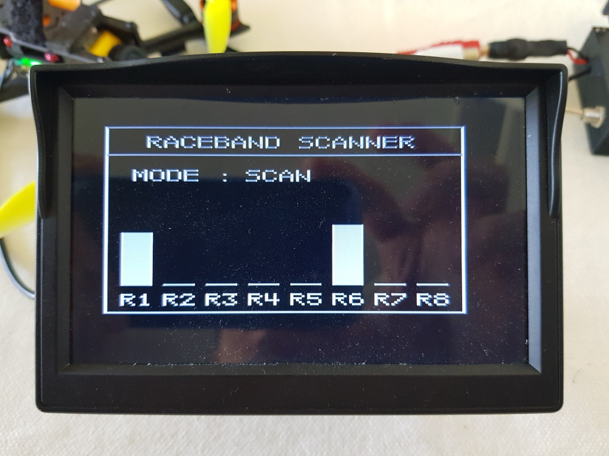

# Raceband Scanner

**This device is a  scanner for the RaceBand 5.8G to check available channels for FPV Pilots.  
The result is shown on the device using LEDs and a screen can be added to view the scanning graph or to view the video feed from the selected channel.   
The device can be used on the field using a lipo battery (3s minimum) or at home with usb.**

     

       

## NEWS FEED:
------------------------------------------------
- 2020-04: First version of the project released 
------------------------------------------------

## Contents

<!-- MarkdownTOC depth=0 bracket="round" autolink="true" autoanchor="true" -->

- [Features](#features)
- [Used parts](#used-parts)
- [Wiring](#wiring)
- [3D Case](#3d-case)
- [Arduino Code](#arduino-code)
- [Setup and Usage Guide](#setup-and-usage-guide)
- [Recognition](#recognition)
- [Contributors](#contributors)

<!-- /MarkdownTOC -->

## Features
- 3 modes included : Manual / Automatic / Scannerw    
	=> Manual : Press Select to change the channel    
	=> Automatic : Press Select to change automatically on the chnannel whith highest signal (RSSI)   
	=> Scanner : Display available channels on the LEDs and show graph on the screen    
- Power supply by Lipo battery (3s minimum) or USB Port (for the device only, use external for the screen in that case)
- Lipo voltage monitoring : Display level of batery when plugging the battery and check if low during usage (turn red + beep)

## Used parts

- 1x PCB Prototype board 50x70mm => https://banggood.app.link/N559qmOQJ5
- 1x RX5808 Module 5.8G Receiver module => https://banggood.app.link/6v3u5r1tJ5
- 1x Passive Buzzer 12mm (Optional) => https://banggood.app.link/EE6gt1oLJ5
- 2x Push Buttons Switch Momentary => https://banggood.app.link/4OSGzJBLJ5 or from kit https://banggood.app.link/t9bOLoGLJ5
- 1x DC-DC Step down converter (set to 9V) => https://banggood.app.link/IfqrpMOLJ5
- 1x 8 LEDS WS2812 5050 RGB => https://banggood.app.link/PKKfUEVLJ5
- 1x Arduino nano V3 : https://banggood.app.link/OwPY6x5LJ5
- 5x Resistors => (2x 220 / 2x 1k / 1x 470)
- 1x XT60 => https://banggood.app.link/CkOhsbz5N5
- 8x M2 Screws 4mm
*** Optional screen but nice to have :) ***
- 1x TFT LCD FPV Mini Monitor Screen Displayer (Optional) => https://banggood.app.link/BduELWmQJ5
- 1x RCA Female => https://banggood.app.link/1RLBWa3KJ5
- 1x DC Male => https://banggood.app.link/rKf3vaM5N5
- 1x 2 positions ON/ON switch : https://banggood.app.link/S85dgTBMJ5

## Wiring

I used the PCB Prototype 50x70 board for wiring. 
Use the schematic and pictures bellow to locate the component exactly the same if you intend to use the 3D Printed case, especially XT60, 2 x buttons, toggle switch and arduino nano

Don't forget to set DC-DC Stepdown cenverter to 9V-10V using a small screwdriver and a multimeter. 
I noticed 12V is too much for the arduino (at least for a clone...).

## 3D Case

STL file is available in 3D case folder.
Print in PLA with 100% infill.
You will need 8 small M2 screws (3 / 4mm) to assemble PCB into the case and close the lid.

## Arduino Code

Download the project from Arduino folder, open **Raceband_Scanner.ino** file with Arduino IDE and upload to the arduino.
In Arduino IDE -> Sketch -> Include Library -> Manage Libraries, search and install for **"FastLED"** and **"TVout"**

Note : FastLED might give you a warning message about version compatibility during upload which is OK.

The code is distrubuted under the MIT license.

## Recognition

- SPI driver based on fs_skyrf_58g-main.c by Simon Chambers
- TVOUT by Myles Metzel

## Contributors

Contributors are very welcome, I'm not either a professional developper nor a professional electronician. 
The code and schematic can probably be improved a lot.

For next versions, here is a list of possible improvement in my head :
- Custom PCB
- Use interuptions for better reaction of buttons
- Slide button with 6 poles instead of toggle switch to get input from the video switch and therefore be used as Mode button (Video <=> Scanner)
- Have only one button
- Make it smaller
- Integrate DC screen supply & video directly in the case

Feel free to ask questions, suggest improvements, report your usage results.

=> Happy flying ! <=

